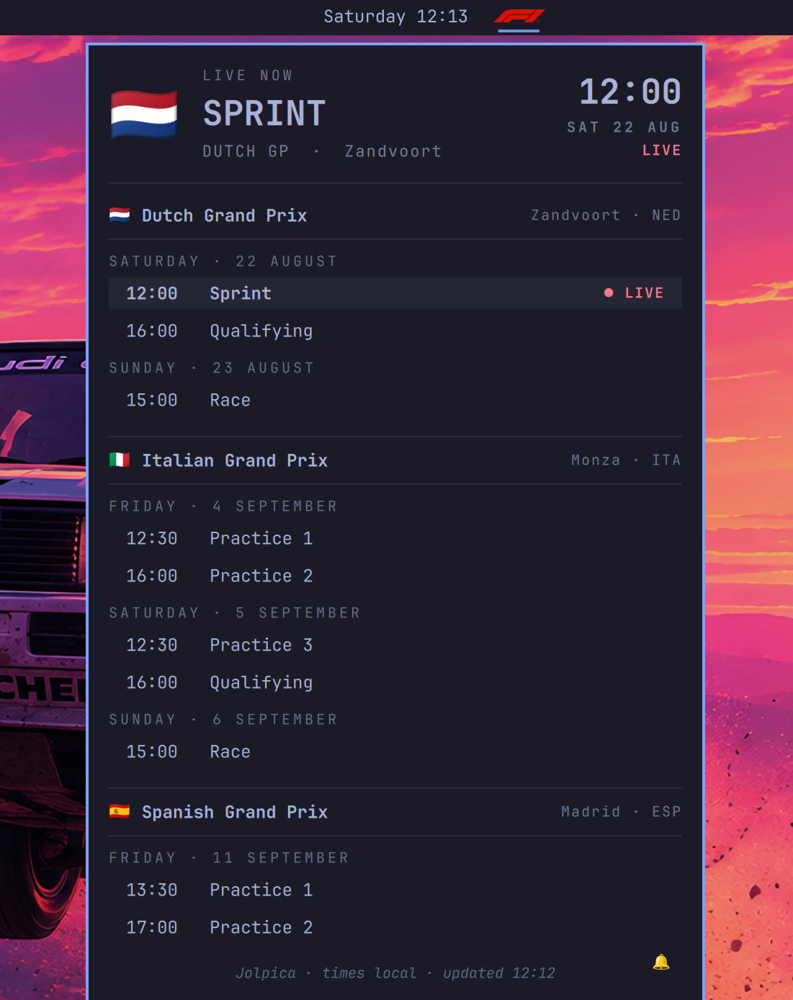
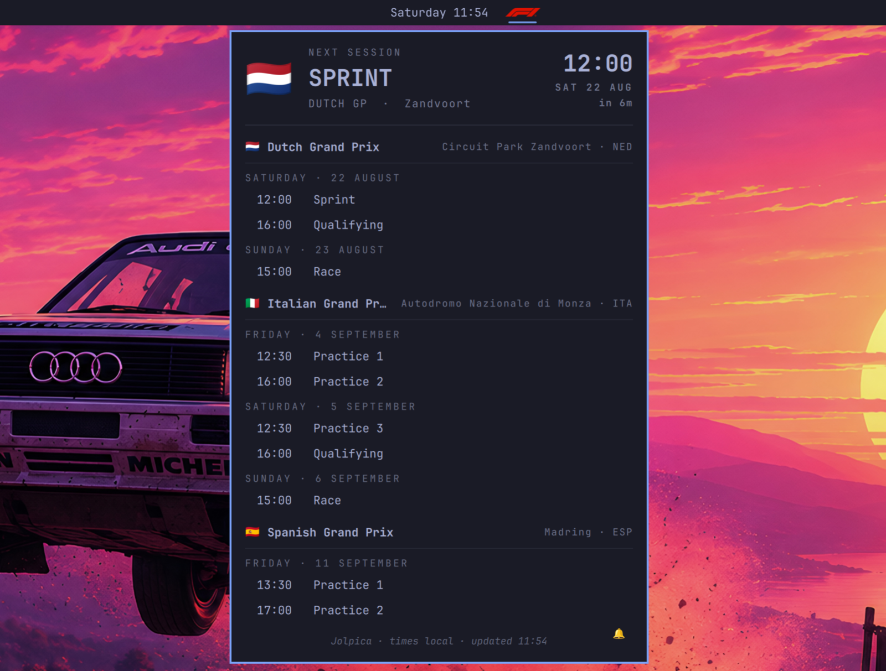
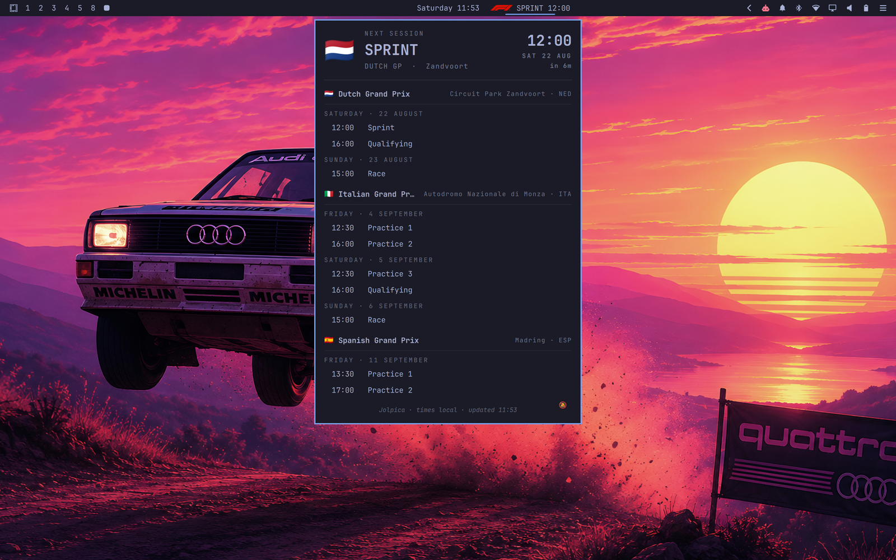

# F1 Sessions for Omarchy


A status-bar widget for [Omarchy](https://omarchy.org/) that counts down to the
next Formula 1 session and lists every upcoming race weekend with full session
schedules.



## Features

- **Bar countdown** to the next F1 session — right-click cycles what it shows:
  next session (`SPRINT 12:00`), time-only, race-weekend view (`NED GP Sat`),
  or logo-only.
- **Schedule popup** listing all upcoming GPs grouped by weekend and day, with
  emoji flags, city/country, live highlighting (`● LIVE`), and the next
  session pinned at the top.
- **Session alerts** — toggle the 🔔 in the panel footer to get a desktop
  notification and short radio-style cue 5 minutes before each session starts.
  A test notification and sound fire when you enable it.
- **Resilient data** — pulls from [OpenF1](https://openf1.org/) and falls back
  to [Jolpica](https://github.com/jolpica/jolpica-f1) automatically if OpenF1
  is unavailable. The footer shows which source is live.
- **Timezone aware** — all times render in your local timezone and re-render
  when it changes.
- **Automatic season rollover** — after the final session ends, the next
  refresh checks the following year's OpenF1 calendar automatically.
- **Bounded API handling** — response sizes, item counts, and remote display
  strings are limited before they reach the panel or tooltip.

## Install

```bash
omarchy plugin add https://github.com/matteodevenuto/omarchy-f1-sessions.git
```

Then open the Plugin Manager and enable **F1 Sessions** on the bar — or:

```bash
omarchy plugin enable matteodevenuto.f1-sessions right
```

## Remove

Remove the plugin and its bar configuration through Omarchy:

```bash
omarchy plugin remove matteodevenuto.f1-sessions
```

## Usage

| Input | Action |
|---|---|
| Left-click | Open/close the schedule panel |
| Right-click | Cycle bar display mode |
| Middle-click | Refresh schedule now |
| 🔔 (panel footer) | Toggle session alerts and play a test alert when enabled |
| 🔊 (panel footer) | Toggle alert audio without disabling desktop notifications |

### IPC

```bash
omarchy-shell matteodevenuto.f1-sessions toggle    # open/close panel
omarchy-shell matteodevenuto.f1-sessions refresh   # refetch schedule
omarchy-shell matteodevenuto.f1-sessions cycleDisplay
```

## Settings

Settings live in the widget entry of `~/.config/omarchy/shell.json`
(`bar.layout.*` → the widget object):

| Key | Default | Description |
|---|---|---|
| `refreshMinutes` | `60` | Schedule refresh interval (minutes) |
| `daysAhead` | `21` | Days of upcoming sessions to show |
| `hideWhenQuiet` | `false` | Hide the bar widget when nothing is scheduled in range |
| `use24h` | `true` | 24-hour times |
| `displayMode` | `"next"` | Bar label mode (`next`, `time`, `weekend`, `logo`) |
| `notifications` | `true` | Alert 5 minutes before each session |
| `notificationSound` | `true` | Play the radio-style cue with session alerts |

### Alert sound

The radio cue plays through PipeWire using `pw-play`. Preview the bundled
sound with:

```bash
pw-play ~/.config/omarchy/plugins/matteodevenuto.f1-sessions/assets/radio-alert.wav
```

Set `notificationSound` to `false` to keep the five-minute desktop alert but
disable its audio. Turning alerts on with the footer bell plays the same sound
as a test; turning alerts off is silent. The adjacent speaker button changes
this setting directly and plays a preview when sound is enabled.

The bundled cue is “f1_radio_sound” by
[u_dn8ylcpe3v](https://pixabay.com/users/u_dn8ylcpe3v-47423286/) via
[Pixabay](https://pixabay.com/sound-effects/film-special-effects-f1-radio-sound-293747/),
used under the [Pixabay Content License](https://pixabay.com/service/license-summary/).
It is incorporated into this plugin and is not offered as a standalone sound.

## Screenshots





## Data sources & disclaimer

Schedule data comes from [OpenF1](https://openf1.org/) with automatic failover
to the Ergast-compatible [Jolpica API](https://api.jolpi.ca/). Thanks to both
projects. When the current OpenF1 calendar has no remaining sessions, the
plugin checks the next calendar year automatically before using Jolpica.
Jolpica data is available for non-commercial use under
[CC BY-NC-SA 4.0](https://creativecommons.org/licenses/by-nc-sa/4.0/), and
requests identify this plugin with a custom user agent as required by Jolpica.

OpenF1 sessions use the API's scheduled start and end timestamps. Jolpica does
not provide end timestamps, so fallback durations are estimated as 60 minutes
for practice, 45 minutes for sprint qualifying, 60 minutes for qualifying and
sprints, and 150 minutes for a race. A session leaves the schedule immediately
after that end time; there is no post-session grace period.

This plugin is unofficial and not associated with Formula 1, the FIA, or any
of their subsidiaries. F1, FORMULA ONE, FIA FORMULA ONE WORLD CHAMPIONSHIP,
GRAND PRIX and related marks are trademarks of Formula One Licensing B.V.
The bundled logo is used solely for identification and comes from
[Wikimedia Commons](https://commons.wikimedia.org/wiki/File:Formula_One_logo.svg).

The MIT license covers the plugin code. The bundled radio cue remains subject
to the Pixabay Content License; see [assets/LICENSE.md](assets/LICENSE.md).

## Development

Omarchy runs the installed copy at
`~/.config/omarchy/plugins/matteodevenuto.f1-sessions/`. Edits made directly
there hot-reload. A separate Git checkout is not linked automatically; sync
its runtime files and rescan the shell with:

```bash
rsync -a BarWidget.qml Model.js Panel.qml f1-logo.svg manifest.json assets \
  ~/.config/omarchy/plugins/matteodevenuto.f1-sessions/
omarchy-shell shell rescanPlugins
```

Validate the project checkout with:

```bash
omarchy plugin validate .
```

Run the parser and input-boundary tests with:

```bash
node --test tests/model.test.js
```

## License

[MIT](LICENSE)
